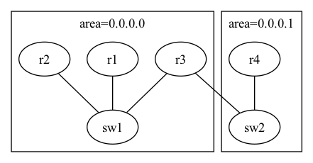

# Group A - Assignment 2

## Assignment

Modify network topology by changing [configuration files](./)
of dot2net input (ospf.yaml, ospf.dot) to achieve the target network topology.
Deploy the modified network configuration with Containerlab and then check that the test cases works correctly.

|Original topology|Target topology|
|-----------------|---------------|
| ||

## Test items

- Test reachability of r1 to r5 with ping6 command
- Test reachability of r5 to r1 with ping6 command
