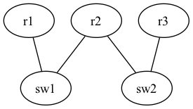
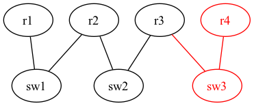

# グループB 課題1

## やること

[このディレクトリ](./)にあるdot2netの入力ファイル(rip.yaml, rip.dot)について、
構築するネットワークのトポロジが目標の構成になるよう修正してください。
それらを用いてContainerlabによりdeployを行い、テスト項目が正しく動作するか確認してください。

現在のトポロジ

目標のトポロジ

## テスト項目

- r1からr4へとpingで通信可能であることを確認する
- r4からr1へとpingで通信可能であることを確認する

