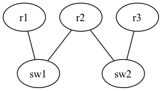
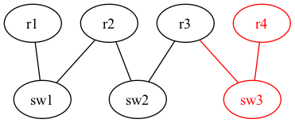

# Group B - Assignment 1

## Assignment

Modify network topology by changing [configuration files](./)
of dot2net input (rip.yaml, rip.dot) to achieve the target network topology.
Deploy the modified network configuration with Containerlab and then check that the test cases works correctly.

|Original topology|Target topology|
|-----------------|---------------|
| ||

## Test items

- Test reachability of r1 to r4 with ping command
- Test reachability of r4 to r1 with ping command

