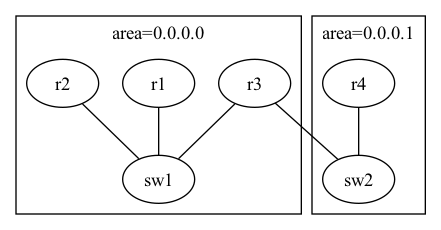
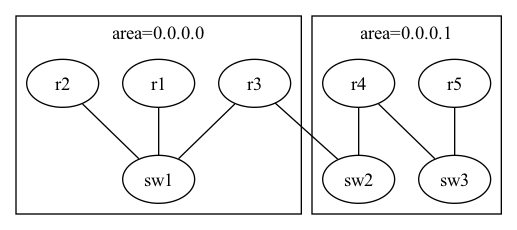

# グループB 課題2

## やること

[このディレクトリ](./)にあるContainerlabの入力(topo.yaml)および各設定ファイルについて、
構築するネットワークのトポロジが目標の構成になるよう修正してください。
それらを用いてContainerlabによりdeployを行い、テスト項目が正しく動作するか確認してください。

|現在のトポロジ  |目標のトポロジ |
|----------------|---------------|
|||

## テスト項目

- r1からr5へとping6で通信可能であることを確認する
- r5からr1へとping6で通信可能であることを確認する

