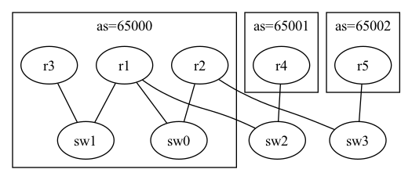
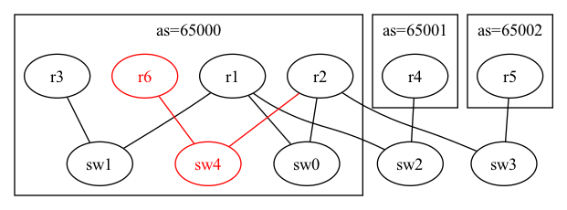

# グループB 課題3

## やること

[このディレクトリ](./)にあるdot2netの入力ファイル(bgp.yaml, bgp.dot)について、
構築するネットワークのトポロジが目標の構成になるよう修正してください。
それらを用いてContainerlabによりdeployを行い、テスト項目が正しく動作するか確認してください。

|現在のトポロジ  |目標のトポロジ |
|----------------|---------------|
|||

ただし、追加されるr6はOSPFルータであり、r2とOSPFで接続します。

## テスト項目

- r4からr6へとpingで通信可能であることを確認する
- r6からr4へとpingで通信可能であることを確認する

