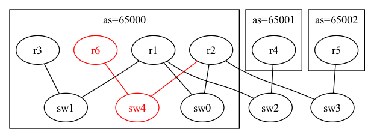

# Group B - Assignment 3

## Assignment

Modify network topology by changing [configuration files](./)
of dot2net input (bgp.yaml, bgp.dot) to achieve the target network topology.
Deploy the modified network configuration with Containerlab and then check that the test cases works correctly.

|Original topology|Target topology|
|-----------------|---------------|
| ||

Note that the additional router r6 is an OSPF router and communicates with r2 on OSPF.

## Test items

- Test reachability of r4 to r6 with ping command
- Test reachability of r6 to r4 with ping command

